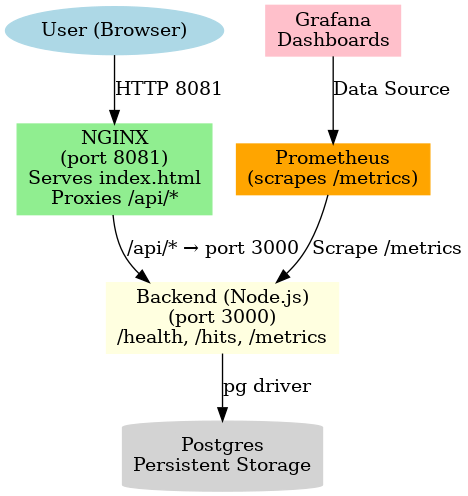

# End-to-End DevOps Demo

This repository demonstrates a complete **end-to-end DevOps pipeline** with CI/CD, observability, and deployment using **Docker Compose**.

---

## 📌 Architecture

The system consists of the following components:

- **Frontend (NGINX)**
  - Serves static files (`index.html`)
  - Proxies API requests (`/api/*`) to the backend
  - Exposed on **port 8081**

- **Backend (Node.js service)**
  - Minimal Node.js HTTP server
  - Endpoints:
    - `/health` → returns service health
    - `/hits` → returns DB-backed counter
    - `/metrics` → exposes Prometheus metrics
  - Connects to PostgreSQL via pg driver
  - Runs on **port 3000** (internal)

- **Database (PostgreSQL)**
  - Stores persistent application data
  - Persistent volume keeps state across restarts
  - Used for tracking hit counters

- **Prometheus**
  - Scrapes backend `/metrics`
  - Provides monitoring data
  - Runs on **port 9090**

- **Grafana**
  - Connects to Prometheus as data source
  - Visualizes metrics in dashboards
  - Runs on **port 3001**

### Diagram



---

## ⚙️ Local Development

Bring up the development environment:

```bash
docker compose -f infra/compose.base.yml -f infra/docker-compose.dev.yml up -d --build
```

Check services:

- Frontend: [http://localhost:8081](http://localhost:8081)
- Backend direct: [http://localhost:3000/health](http://localhost:3000/health)
- Metrics: [http://localhost:3000/metrics](http://localhost:3000/metrics)
- Prometheus: [http://localhost:9090](http://localhost:9090)
- Grafana: [http://localhost:3001](http://localhost:3001)

Stop everything:

```bash
docker compose -f infra/compose.base.yml -f infra/docker-compose.dev.yml down -v
```

---

## 🧪 Smoke Tests

The repository includes a `scripts/smoke.sh` script for health verification:

```bash
./scripts/smoke.sh
```

It checks:
1. Backend health (`/api/health`)
2. Frontend index (`index.html`)
3. Metrics endpoint (`/api/metrics`)

---

## 🚀 CI/CD Workflows

### 1. CI (Build & Test)
- Triggered on pull requests and pushes to `dev` or `feature/*`
- Runs smoke tests in GitHub Actions

### 2. Release (Build & Push)
- Triggered on push to `main`
- Builds Docker images for:
  - `backend`
  - `web`
- Pushes them to GitHub Container Registry (**GHCR**)

### 3. Deploy (Self-hosted)
- Triggered manually (`workflow_dispatch`)
- Pulls latest images from GHCR
- Runs production stack on a **self-hosted runner**

### 4. Switch (Self-Hosted)
- Triggered manually (workflow_dispatch)
- Runs on the self-hosted runner (local WSL instance)
- Allows switching live traffic between Blue and Green environments with zero downtime

### 5. Staging (Self-hosted)
- Triggered on push to staging
- Runs staging slack on the self-hosted runner (local WSL instance)
---

## 🟦🟩 Blue-Green Deployment

We support **blue-green deployment**:

- `docker-compose.bluegreen.yml` defines parallel blue/green stacks
- `blue-active.yml` → BLUE serves traffic on port 8081
- `green-active.yml` → GREEN serves traffic on port 8081 (flip switch)

Test sequence:

```bash
# Bring up both (Blue = 8081, Green = 8082)
docker compose -f infra/compose.base.yml -f infra/docker-compose.prod.yml -f infra/bluegreen/docker-compose.bluegreen.yml up -d

# Flip live traffic to GREEN
docker compose -f infra/compose.base.yml -f infra/docker-compose.prod.yml -f infra/bluegreen/docker-compose.bluegreen.yml -f infra/bluegreen/green-active.yml up -d
```

---

## 📊 Observability

- **Prometheus** scrapes `/metrics`
+ **Prometheus** scrapes `/metrics` from both `backend-blue` and `backend-green` in Blue/Green mode
- **Grafana** visualizes metrics
+ **Grafana** visualizes metrics (e.g. HTTP rate, errors, DB counters)

---

## ✅ Data Persistence Demo

1. Start the stack and hit `/api/hits` a few times
2. Stop and restart containers (`down` without `-v`)
3. Check `/api/hits` again → counter is preserved
4. Run with `down -v` → counter resets (volume removed)

---

## 🔑 Branching & Protection

- Development work happens on `dev` branch
- `main` branch is **protected**
  - Requires pull requests
  - Requires CI checks to pass
- Releases are merged into `main`

---

## 👨‍💻 How to Contribute

1. Fork this repository
2. Create a feature branch (`feature/my-change`)
3. Commit and push changes
4. Open a pull request into `dev`

---

## 📝 License

This project is for **educational/demo purposes only**.

Test CI/CD Flow
Test 2 
Test 3
Test for prod deployment